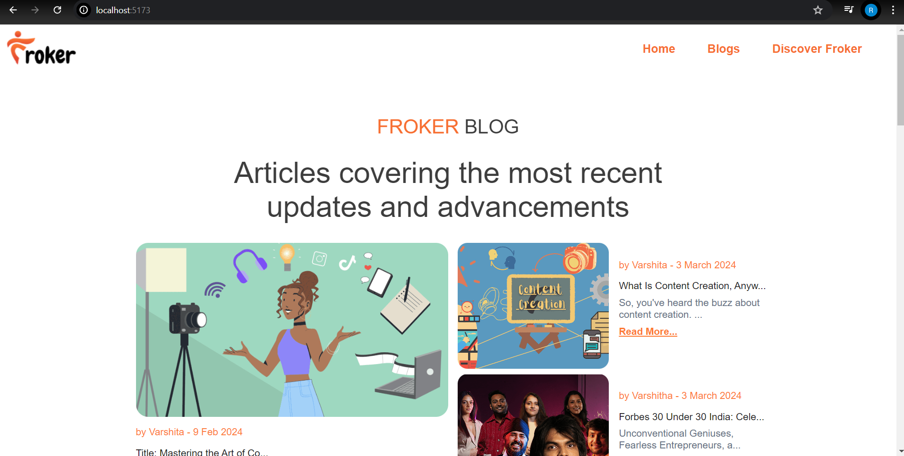
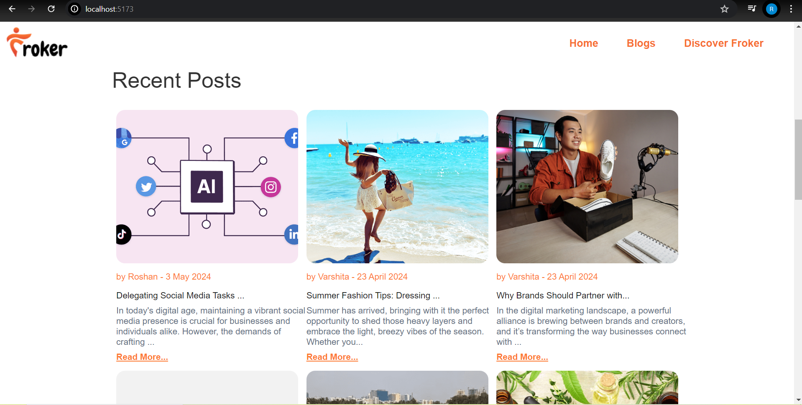
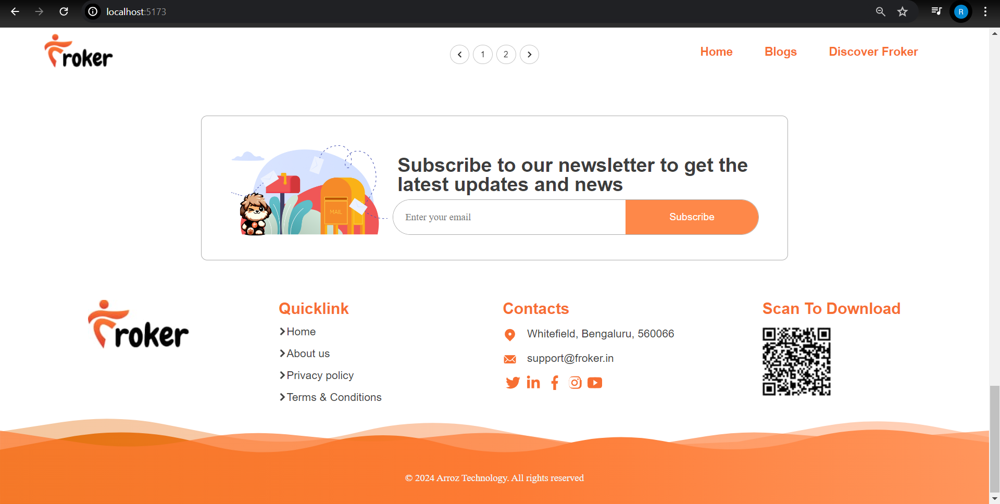
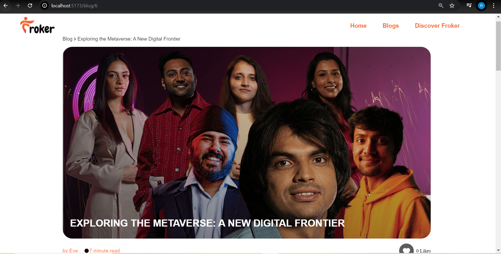
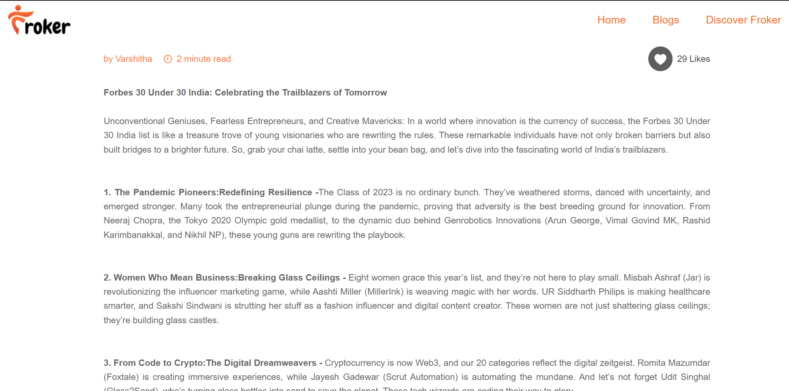

# Froker Website

A full-stack blog website where users can view blog posts, read detailed content, and like posts. Built with React for the frontend, Express for the backend, and MongoDB for data storage.

## Features

- **View Blog List:** See a list of blog posts on the homepage.
- **Read Blog Details:** Access detailed content of each blog post.
- **Like Blog Posts:** Users can like posts, with one like allowed per user.

## Technologies Used

- **Frontend:** React.js
- **Backend:** Node.js with Express
- **Database:** MongoDB
- **Styling:** CSS

## Project Structure
```bash
Froker-website/
│
├── Client/ # React client application
│ ├── public/
│ ├── src/
│ │ ├── components/ # React components
│ │ ├── styles/ # CSS files
│ │ └── App.js # Main React component
│ ├── package.json # Client dependencies and scripts
│ └── ...
│
├── Server/ # Express server application
│ ├── models/ # Mongoose schemas/models
│ ├── routes/ # API routes
│ ├── index.js # Main server entry point
│ ├── package.json # Server dependencies and scripts
│ └── ...
│
├── .gitignore # Git ignore file
└── README.md # This README file
```
## Screenshots

### Homepage
*The main page displaying a list of blog posts.*
|   |  |
|-------------------------------------------|-------------------------------------------|
| Image 1                                   | Image 2                                   |

|  |  |
|-------------------------------------------|-------------------------------------------|
| Image 3                                   | Image 4                                   |


### Blog Post Detail
*Detailed view of a single blog post including the title, thumbnail, and content.*

|  |  |
|--------------------------------------------------|---------------------------------------------------|
| Image 1                                          | Image 2                                           |


### Like Feature


*The like button functionality in action.*

## Setup Instructions

### Prerequisites

- Node.js and npm installed
- MongoDB running on your local machine or a remote instance

### 1. Clone the Repository

```bash
git clone https://github.com/your-username/your-repo-name.git
cd your-repo-name
```
#### Navigate into the project directory:
```bash
cd your-repo-name
```
### 2. Install Dependencies
#### Backend
1.Navigate to the server directory:

```bash
cd Server
```
2.Install backend dependencies:

```bash
npm install
```
3.Create a .env file in the Server directory with your MongoDB connection string. Example:

```env
MONGO_URI=mongodb://localhost:27017/Blog
```
4.Start the backend server:

```bash
npm start
```
#### Frontend
1.Open a new terminal window or tab and navigate to the client directory:

```bash
cd Client
```
2.Install frontend dependencies:

```bash
npm install
```
3.Start the frontend development server:

```bash
npm start
```
## 3. Access the Application
Once both the backend and frontend servers are running, you can access the application by visiting http://localhost:3000 in your web browser.

## 4. API Endpoints
Here are some of the key API endpoints for the application:
<li>Get all blogs: GET /api/blogs</li>
<li>Get a blog by ID: GET /api/blogs/:id</li>
<li>Like a blog: POST /api/blogs/:id/like</li>

## 6. Troubleshooting
If you encounter issues, ensure that:

<li>MongoDB is running.</li>
<li>Both backend and frontend servers are correctly configured and running.</li>
<li>All environment variables are set correctly.</li>
For further assistance, please refer to the documentation or open an issue on the GitHub repository.

